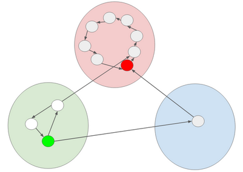

# Background

Please see [GOALS.pdf](./GOALS.pdf) for details.

# Delivered Algorithms

## Graph Data Structure

Because of the algorithms we wanted to use, we wanted fast runtimes for the following functions: (1) `insertVertex`, (2) `insertEdge`, and (3) `incidentEdges`. 
We found that the code from `lab_ml` is implemented as an adjacency list and fulfilled our requirements, since the functions had respective big-Os of `O(1)`, `O(1)`, and `O(deg(V))`. So, we used the code provided from lab_ml and modified it for our needs. We verified functionality by checking against hardcoded test cases with Catch2.
## BFS Traversal

We refer to a BFS traversal over the full graph as a “full BFS”, and a connected BFS traversal only traversing existent edges as a “connected BFS”. 

The problem statement was to produce output to demonstrate a full BFS. 
We implemented this algorithm as an iterator. 
We first implemented the `BFSTraversal` class, which produced an iterator from its nested `Iterator` class that returns a connected BFS traversal (when dereferenced and incremented). 
We implemented an iterator because (1) it was easily reusable, (2) it was kinder to memory usage than returning a vector of all vertices, and (3) it provided an easy API when doing loops over it.

We then defined our `FullBFS` class to inherit from `BFSTraversal`, and `FullBFS::Iterator` to inherit from `BFSTraversal::Iterator`, since the only difference was the logic for adding a new vertex to the traversal. 
We verified functionality by checking against hardcoded test cases with Catch2.

## Detecting Strongly Connected Components 

We will refer to strongly connected components as SCCs. 
The problem statement was to produce output to identify the SCCs and membership in SCCs. 
We implemented this algorithm as the `SCCGraph` class, inheriting from our `Graph` class. 
This is because we wanted to use the DAG produced from detecting SCCs to accelerate our landmark path algorithm -- specifically, we would use this to perform reachability queries from one vertex to another, since if one SCC is reachable from another, then vertices in the first can reach vertices in the second SCC (by definition of SCCs).
We used Tarjan’s algorithm to produce the algorithm, since the alternative (Kosaraju) required a reversal of all edges in our graph to correctly work.
Furthermore, research showed that Tarjan’s algorithm performs faster in real world situations.
We verified functionality by checking against hardcoded test cases, as well as test cases that we generated using a Python script we wrote, `make-mock.py`, along with the networkx module to automatically create random graphs and their strongly connected components, and dump them to files so that we can check if our algorithms work on a large scale.

## Landmark Path Algorithm (Shortest path from A to B through L)

We implemented this function as a function that returns a vector of vertices to visit.
This is because this would give the most straightforward way of displaying the results, and by nature of the algorithm, it cannot be implemented dynamically like a BFS traversal.
In developing this algorithm, we created a `getShortestPath` algorithm in our general Graph class and we improved our BFS traversal iterator as well.
We verified functionality by checking against hardcoded test cases for the Landmark Path algorithm specifically, and by verifying our `getShortestPath` algorithm using hardcoded test cases.

# Delivered Binaries

We deliver three notable executables. 
The first is `wikiqueria`, which is an interactive tool that a user may use to discover properties about their graph in question. 
The second is `benchmark`, which can be used to run benchmarking on algorithms.
The third is `test`, which contains all of our unit tests that we used to document and verify development.
All of these algorithms support command line options to pass various useful parameters, such as limiting the number of edges to be loaded. 

# Interesting Discoveries (Dataset insights)

We were able to make some discoveries about our dataset. However, we started to have trouble with the memory usage for our dataset (particular, loading all of the edges). So, we started to 

## Sizes of strongly detected components

We were able to sort the number of strongly detected components in our Wikipedia dataset:

| Size of SCC | Count |
| ---: | ---: |
| 45486 | 1 |
| 14 | 1 | 
| 7  | 2 | 
| 6  | 2 | 
| 5  | 1 | 
| 4  | 15 | 
| 3  | 95 | 
| 2  | 1968 | 
| 1  | 4156973 | 

Having a very large connected component of size 45486 is expected, since the Wikipedia Game is a game about getting from one Wikipedia page to another.
So, we expect many pages to be reachable from one another, otherwise such a game would not make sense.

We also expected to have a very large number of SCCs of size 1, since we were not able to load all of the edges in our dataset due to RAM concerns -- this would result in a perhaps large number of pages that have no links from one to another.

## Members of strongly detected components

Another interesting discovery is that the articles in the smaller SCCs tend to be very related to one another. For example, the articles in the SCC of size 5 were all about figure skating:

| Node ID | Page Name | Brief |
| --- | --- | --- | 
| 592572 | Robin Szolkowy | Name of a German figure skater |
| 592568 | Zhang Dan | Name of Chinese figure skater |
| 592150 | Four Continents Figure Skating Championships | Figure skating competition |
| 586713 | Alexander Pavlov (figure skater) | Name of figure skater | 
| 592314 | Ondrej Nepela Memorial | Name of figure skating trophy | 

# Interesting Discoveries (Development insights)

## Boolean to mark empty edge causes bloat

In order to use certain STL containers, we needed to define a default constructor for an edge.
We wanted to store a boolean to denote whether a given edge was "empty", but when we implemented this, we noticed our program was using much more memory.
On investigation, we discovered that previously, the edge containing only two `size_t`s (each for a page ID) was `sizeof(Edge) == 16` bytes, but after adding a boolean, `sizeof(Edge) == 24` bytes: 50% more memory!
We concluded that this was due to padding, and we resolved this by marking an empty edge as having start and end IDs equal to `(size_t)(-1)` (max value of `size_t`).

## Pruning a BFS with SCC traversals does not return the shortest path

Our first idea with the SCCGraph was to use it to speed up our BFS: given page A and page B, we would first run `SCCGraph.getShortestPath(SCC(A) ,SCC(B))`, where `SCC(X)` returns the identifier for the SCC that X belongs to. Then, we would keep track of all SCCs that we visited, and then we run `Graph.getShortestPath(A, B)`, but we ignore any vertices whose SCCs we did not encounter. However, we discovered that this does not yield the fastest path: below is a counterexample:

If we applied our theoretical algorithm and tried to get from dark green to dark red, we would completely avoid the blue SCC, since the SCC BFS would only return the red SCC and green SCC. However, the fastest path involves a path through the blue SCC.

We resolved to use the SCCGraph for reachability queries only.